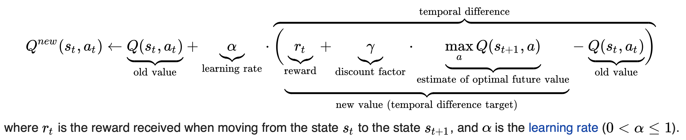

# CS3243 Project 2

## Task 1: Sudoku

Navigate to the folder `CS3243_P2/sudoku`, run the command `python CS3243_P2_Sudoku_47.py input4.txt dump.txt` to test the solver algorithm.

:warning:The performance time below includes the printing of debugging table. Actual performance is faster when no debug information is printed on the console.


**General algorithm**
* Maintain the list of assignable numbers for each empty cell on the board as constraints
* Use backtracking to try all the assignable numbers for each cell 
  * If the trial does not violate Sudoku rules, proceed to the next empty cell.
  * If it violates, backtrack by resetting the current cell empty and go back to the previous assignment.
* After each valid assignment, update the list of assignable numbers for all remaining empty cells on the board


**Approach 1:**
* Fill the empty cell from top-down, left to right
* Try out each assignable number in ascending order

**Results:**
* Input1: `24.9235s`
* Input2: `2.7022s`
* Input3: `2.1306s`
* Input4: `0.4958s`


**Approach 2:**
* Fill the empty cell from top-down, left to right
* Try out each assignable number in random order

**Results:**

* Input1: `25.6315s (better case),  213.7323s (worse case)`
* Input2: `6.1811s  (better cases), 12.1366s  (worse case)`
* Input3: `0.9792s`
* Input4: `0.7423s`

> Notes:

> The time taken varies largely. On average, there is no significant improvements from approach 1. For more difficult cases like input1 and input2, this approach struggles to compute the answer occasionally.


**Approach 3:**
* Fill the empty cell from top-down, left to right
* Try out each assignable number in ascending order
* Perform forward checking: stop early when constraints are 
not satisfiable (some empty cells already have no assignable number)

**Results:**
* Input1: `11.5302s`
* Input2: `0.6481s`
* Input3: `0.3025s`
* Input4: `0.2247s`

> Notes:

> The addition of forward checking has improved performance
by more than half in most cases.


**Approach 4:**
* Fill the empty cell starting with the highest degree of constraints (least number of assignable number)
* Try out each assignable number in ascending order
* Perform forward checking: stop early when constraints are 
not satisfiable (some empty cells already have no assignable number)

**Results:**
* Input1: `3.9446s`
* Input2: `0.04649s`
* Input3: `0.01629s`
* Input4: `0.02353s`

> Notes:

> The heuristic of "sorting by degree of constraints" has further improved the performance. It is because we further narrowed down the number of possibilities to try the assignment.


## Task 2: The Pacman Game

### Q-learning
The update formula for the Q-value from [Wikipedia](https://en.wikipedia.org/wiki/Q-learning)



**Task 1**
```
Run "python2 pacman.py -p PacmanQAgent -x 2000 -n 2010 -l smallGrid"

	Completed 2000 out of 2000 training episodes
	Average Rewards over all training: -50.29
	Average Rewards for last 100 episodes: 245.66
	Episode took 1.12 seconds

	Average Score: 500.2
	Win Rate:      10/10 (1.00)


Run "python2 autograder.py -q q1"

	Reinforcement Learning Status:
		Completed 100 test episodes
		Average Rewards over testing: 500.48
		Average Rewards for last 100 episodes: 500.48
		Episode took 1.15 seconds
	
	Average Score: 500.48
	Win Rate:      100/100 (1.00)
```


### Game State

The `GameState` class in `pacman.py` specifies the full game state, including the food, capsules, agent configurations and score changes.

It is used by the `Game` object to capture the actual state of the game and **also used by the agent to reason about the game**.

* `getLegalActions( self, agentIndex=0 )`: returns the legal actions for the specified agent; returns `[]` if no action is possible (i.e. in the terminal state)


### Inheritance Tree (agent)
```
Agent                           (game.py)
|
 --> ValueEstimationAgent       (learningAgents.py) 
  |
   --> ReinforcementAgent       (learningAgents.py)
    |
     --> QlearningAgent         (qlearningAgents.py)*
      |
       --> PacmanQAgent         (qlearningAgents.py)
        |
         --> ApproximateQAgent  (qlearningAgents.py)*
```


**QLearningAgent**

* Attributes:

```
alpha -------- learning rate
epsilon ------ exploration rate
gamma -------- discount factor
numTraining -- number of training episodes

actionFn = lambda state: state.getLegalActions()
	(function that takes a state, returns a list of legal actions)

```

* Functions:


> **getQValue(self, state, action):**
```
- if a state has not seen, return 0.0
- otherwise return the Q-value of given state & action pair
```

> **computeValueFromQValues(self, state):**
```
- return an action that gives the maximum Q-value among all legal actions
- if no legal action exists, return 0.0
```

> **computeActionFromQValues(self, state):** 
```
- return the best action (the one that gives the highest Q-value) for a given state 
- if no legal action exists, return `None`
```

> **getAction(self, state):**
```
- return the action to take given the state 
- if no legal action exists, return `None`. 
- the action can be either to explore random choices or follow the policy 
- the probability to explore is given by `self.epsilon`
```

> **update(self, state, action, nextState, reward):** 
```
- update the Q-value for state & action pair, given the reward for current state and Q-value in nextState 
- the calculation is based on the Q-learning formula above.

```

**ApproximateQAgent**

* Attributes:
```
featExtractor = util.lookup(extractor, globals())()
weights = util.Counter()
```

* `getQValue(self, state, action)`: return `Q(state,action) = w * featureVector` where `*` is the dotProduct operator

* `update(self, state, action, nextState, reward)`: update weights based on transition


### Inheritance Tree (extractor)

```
FeatureExtractor              (featureExtractors.py)
|
 --> IdentityExtractor
|
 --> CoordinateExtractor
|
 --> SimpleExtractor (worth looking at implementation)
|
 --> NewExtractor (design your own)*
```


### Utility

**Functions**

* `flipCoin(p)`: return true with the given probability `p`


**Counter**

A counter maintains counts for some keys. It extends from dictionary with number values (integer / float). 

```
{'test': 2, 'blah': 1, 'item': 5}
```

All keys are defaulted to have value 0. Hence, we can count things without initialisation.

```
a = Counter()
a['blah'] += 1
print(a['blah'])

The terminal will print 1 without error.
```

* `incrementAll(self, keys, count)`: increment all values of the keys by the same count

* `argMax(self)`: return the key with the highest value

* `sortedKeys(self)`: return a list of keys sorted by their values in descending order

* `totalCount(self)`: return the sum of counts for all keys

* `normalize(self)`: edit the counter such that total count of all keys equals 1. The ratio of counts for keys remains the same.

* `divideAll(self, divisor)`: divide all counts by divisor
